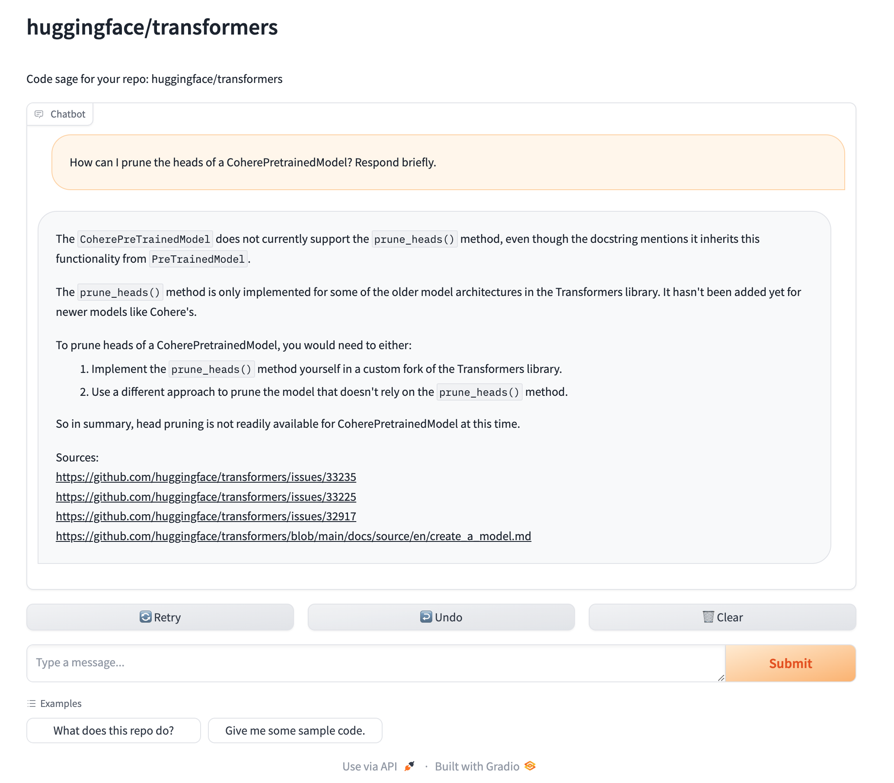

<div align="center">
    
    <h1 align="center">Sage: Chat with any codebase</h1>
    <div>
        <a href="https://discord.gg/EmmJgmD2" target=="_blank"></a>
        <a href="https://x.com/StoriaAI" target=="_blank"></a>
        <a href="https://github.com/Storia-AI/sage/stargazers" target=="_blank"></a>
        <a href="https://github.com/Storia-AI/sage/blob/main/LICENSE" target=="_blank"></a>
    </div>
    <br />
    <figure>
        <!-- The <kbd> and <sub> tags are work-arounds for styling, since GitHub doesn't take into account inline styles. Note it might display awkwardly on other Markdown editors. -->
        <kbd></kbd>
        <sub><figcaption align="center">Our chat window, showing a conversation with the Transformers library. 🚀</sub></figcaption>
    </figure>
</div>

# Getting started

## Installation

<details open>
<summary><strong>Using pipx (recommended) </strong></summary>
Make sure pipx is installed on your system (see <a href="https://pipx.pypa.io/stable/installation/">instructions</a>), then run:

```
pipx install git+https://github.com/Storia-AI/sage.git@main
```

</details>

<details>
<summary><strong>Using venv and pip</strong></summary>
Alternatively, you can manually create a virtual environment and install Code Sage via pip:

```
python -m venv sage-venv
source sage-venv/bin/activate
pip install git+https://github.com/Storia-AI/sage.git@main
```

</details>

## Prerequisites

`sage` performs two steps:

1. Indexes your codebase (requiring an embdder and a vector store)
2. Enables chatting via LLM + RAG (requiring access to an LLM)

<details open>
<summary><strong>:computer: Running locally (lower quality)</strong></summary>

1. To index the codebase locally, we use the open-source project <a href="https://github.com/marqo-ai/marqo">Marqo</a>, which is both an embedder and a vector store. To bring up a Marqo instance:

    ```
    docker rm -f marqo
    docker pull marqoai/marqo:latest
    docker run --name marqo -it -p 8882:8882 marqoai/marqo:latest
    ```

    This will open a persistent Marqo console window. This should take around 2-3 minutes on a fresh install.

2. To chat with an LLM locally, we use <a href="https://github.com/ollama/ollama">Ollama</a>:

    - Head over to [ollama.com](https://ollama.com) to download the appropriate binary for your machine.
    - Open a new terminal window
    - Pull the desired model, e.g. `ollama pull llama3.1`.

</details>

<details>
<summary><strong>:cloud: Using external providers (higher quality)</strong></summary>

1. For embeddings, we support <a href="https://platform.openai.com/docs/guides/embeddings">OpenAI</a> and <a href="https://docs.voyageai.com/docs/embeddings">Voyage</a>. According to [our experiments](benchmarks/retrieval/README.md), OpenAI is better quality. Their batch API is also faster, with more generous rate limits. Export the API key of the desired provider:

    ```
    export OPENAI_API_KEY=... # or
    export VOYAGE_API_KEY=...
    ```

2. We use <a href="https://www.pinecone.io/">Pinecone</a> for the vector store, so you will need an API key:

    ```
    export PINECONE_API_KEY=...
    ```
    If you want to reuse an existing Pinecone index, specify it. Otherwise we'll create a new one called `sage`.
    ```
    export PINECONE_INDEX_NAME=...
    ```

3. For reranking, we support <a href="https://developer.nvidia.com/blog/enhancing-rag-pipelines-with-re-ranking/">NVIDIA</a>, <a href="https://docs.voyageai.com/docs/reranker">Voyage</a>, <a href="https://cohere.com/rerank">Cohere</a>, and <a href="https://jina.ai/reranker/">Jina</a>. According to [our experiments](benchmark/retrieval/README.md), NVIDIA performs best. Note: for NVIDIA you should use the `nvidia/nv-rerankqa-mistral-4b-v3` reranker. 

Export the API key of the desired provider:
    ```
    export NVIDIA_API_KEY=...  # or
    export VOYAGE_API_KEY=...  # or
    export COHERE_API_KEY=...  # or
    export JINA_API_KEY=...
    ```

4. For chatting with an LLM, we support OpenAI and Anthropic. For the latter, set an additional API key:
    ```
    export ANTHROPIC_API_KEY=...
    ```

For easier configuration, adapt the entries within the sample `.sage-env` (change the API keys names based on your desired setup) and run:
```
source .sage-env
```
</details>

### Optional
If you are planning on indexing GitHub issues in addition to the codebase, you will need a GitHub token:

    export GITHUB_TOKEN=...

## Running it

1. Select your desired repository:
    ```
    export GITHUB_REPO=huggingface/transformers
    ```

2. Index the repository. This might take a few minutes, depending on its size.
    ```
    sage-index $GITHUB_REPO
    ```
    To use external providers instead of running locally, set `--mode=remote`.

3. Chat with the repository, once it's indexed:
    ```
    sage-chat $GITHUB_REPO
    ```
    To use external providers instead of running locally, set `--mode=remote`.
</details>

### Notes:
- To get a public URL for your chat app, set `--share=true`.
- You can overwrite the default settings (e.g. desired embedding model or LLM) via command line flags. Run `sage-index --help` or `sage-chat --help` for a full list.

## Additional features

<details>
<summary><strong>:hammer_and_wrench: Control which files get indexed</strong></summary>

You can specify an inclusion or exclusion file in the following format:
```
# This is a comment
ext:.my-ext-1
ext:.my-ext-2
ext:.my-ext-3
dir:my-dir-1
dir:my-dir-2
dir:my-dir-3
file:my-file-1.md
file:my-file-2.py
file:my-file-3.cpp
```
where:
- `ext` specifies a file extension
- `dir` specifies a directory. This is not a full path. For instance, if you specify `dir:tests` in an exclusion directory, then a file like `/path/to/my/tests/file.py` will be ignored.
- `file` specifies a file name. This is also not a full path. For instance, if you specify `file:__init__.py`, then a file like `/path/to/my/__init__.py` will be ignored.

To specify an inclusion file (i.e. only index the specified files):
```
sage-index $GITHUB_REPO --include=/path/to/inclusion/file
```

To specify an exclusion file (i.e. index all files, except for the ones specified):
```
sage-index $GITHUB_REPO --exclude=/path/to/exclusion/file
```
By default, we use the exclusion file [sample-exclude.txt](sage/sample-exclude.txt).
</details>

<details>
<summary><strong>:bug: Index open GitHub issues</strong></summary>
You will need a GitHub token first:
```
export GITHUB_TOKEN=...
```

To index GitHub issues without comments:
```
sage-index $GITHUB_REPO --index-issues
```

To index GitHub issues with comments:
```
sage-index $GITHUB_REPO --index-issues --index-issue-comments
```

To index GitHub issues, but not the codebase:
```
sage-index $GITHUB_REPO --index-issues --no-index-repo
```
</details>

# Why chat with a codebase?

Sometimes you just want to learn how a codebase works and how to integrate it, without spending hours sifting through
the code itself.

`sage` is like an open-source GitHub Copilot with the most up-to-date information about your repo.

Features:

- **Dead-simple set-up.** Run *two scripts* and you have a functional chat interface for your code. That's really it.
- **Heavily documented answers.** Every response shows where in the code the context for the answer was pulled from. Let's build trust in the AI.
- **Runs locally or on the cloud.**
- **Plug-and-play.** Want to improve the algorithms powering the code understanding/generation? We've made every component of the pipeline easily swappable. Google-grade engineering standards allow you to customize to your heart's content.

# Changelog

- 2024-09-16: Renamed `repo2vec` to `sage`.
- 2024-09-03: Support for indexing GitHub issues.
- 2024-08-30: Support for running everything locally (Marqo for embeddings, Ollama for LLMs).

# Want your repository hosted?

We're working to make all code on the internet searchable and understandable for devs. You can check out our early product, [Code Sage](https://sage.storia.ai). We pre-indexed a slew of OSS repos, and you can index your desired ones by simply pasting a GitHub URL.

If you're the maintainer of an OSS repo and would like a dedicated page on Code Sage (e.g. `sage.storia.ai/your-repo`), then send us a message at [founders@storia.ai](mailto:founders@storia.ai). We'll do it for free!


# Extensions & Contributions

We built the code purposefully modular so that you can plug in your desired embeddings, LLM and vector stores providers by simply implementing the relevant abstract classes.

Feel free to send feature requests to [founders@storia.ai](mailto:founders@storia.ai) or make a pull request!
