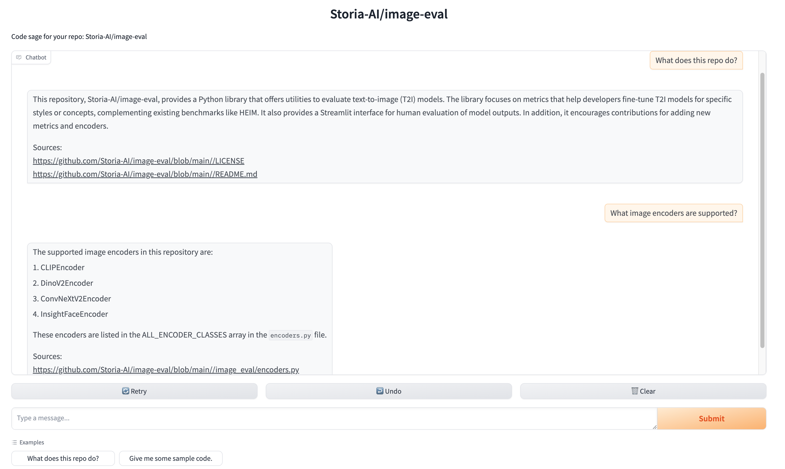

# What is this?

*TL;DR*: `repo2vec` is a simple-to-use, modular library enabling you to chat with any public or private codebase.



**Ok, but why chat with a codebase?**

Sometimes you just want to learn how a codebase works and how to integrate it, without spending hours sifting through
the code itself.

`repo2vec` is like GitHub Copilot but with the most up-to-date information about your repo.

Features:
- **Dead-simple set-up.** Run *two scripts* and you have a functional chat interface for your code. That's really it.
- **Heavily documented answers.** Every response shows where in the code the context for the answer was pulled from. Let's build trust in the AI.
- **Runs locally or on the cloud.**
    - Want privacy? No problem: you can use [Marqo](https://github.com/marqo-ai/marqo) for embeddings + vector store and [Ollama](ollama.com) for the chat LLM.
    - Want speed and high performance? Also no problem. We support OpenAI batch embeddings + [Pinecone](https://www.pinecone.io/) for the vector store + OpenAI or Anthropic for the chat LLM.
- **Plug-and-play.** Want to improve the algorithms powering the code understanding/generation? We've made every component of the pipeline easily swappable. Google-grade engineering standards allow you to customize to your heart's content.

# How to run it

## Installation
To install the library, simply run `pip install repo2vec`.

## Indexing the codebase
We currently support two options for indexing the codebase:

1. **Locally**, using the open-source [Marqo vector store](https://github.com/marqo-ai/marqo). Marqo is both an embedder (you can choose your favorite embedding model from Hugging Face) and a vector store.

    You can bring up a Marqo instance using Docker:
    ```
    docker rm -f marqo
    docker pull marqoai/marqo:latest
    docker run --name marqo -it -p 8882:8882 marqoai/marqo:latest
    ```

    Then, to index your codebase, run:
    ```
    index github-repo-name \  # e.g. Storia-AI/repo2vec
        --embedder-type=marqo \
        --vector-store-type=marqo \
        --index-name=your-index-name
    ```

2. **Using external providers** (OpenAI for embeddings and [Pinecone](https://www.pinecone.io/) for the vector store). To index your codebase, run:
    ```
    export OPENAI_API_KEY=...
    export PINECONE_API_KEY=...

    index github-repo-name \  # e.g. Storia-AI/repo2vec
        --embedder-type=openai \
        --vector-store-type=pinecone \
        --index-name=your-index-name
    ```
    We are planning on adding more providers soon, so that you can mix and match them. Contributions are also welcome!

## Indexing GitHub Issues
You can additionally index GitHub issues by setting the `--index-issues` flag. Conversely, you can turn off indexing the code (and solely index issues) by passing `--no-index-repo`.

## Chatting with the codebase
We provide a `gradio` app where you can chat with your codebase. You can use either a local LLM (via [Ollama](https://ollama.com)), or a cloud provider like OpenAI or Anthropic.

To chat with a local LLM:
1. Head over to [ollama.com](https://ollama.com) to download the appropriate binary for your machine.
2. Pull the desired model, e.g. `ollama pull llama3.1`.
3. Start the `gradio` app:
    ```
    chat github-repo-name \  # e.g. Storia-AI/repo2vec
        --llm-provider=ollama
        --llm-model=llama3.1
        --vector-store-type=marqo \  # or pinecone
        --index-name=your-index-name
    ```

To chat with a cloud-based LLM, for instance Anthropic's Claude:
```
export ANTHROPIC_API_KEY=...

chat github-repo-name \  # e.g. Storia-AI/repo2vec
    --llm-provider=anthropic \
    --llm-model=claude-3-opus-20240229 \
    --vector-store-type=marqo \  # or pinecone
    --index-name=your-index-name
```
To get a public URL for your chat app, set `--share=true`.

# Peeking under the hood

## Indexing the repo
The `repo2vec/index.py` script performs the following steps:
1. **Clones a GitHub repository**. See [RepoManager](repo2vec/repo_manager.py).
    - Make sure to set the `GITHUB_TOKEN` environment variable for private repositories.
2. **Chunks files**. See [Chunker](repo2vec/chunker.py).
    - For code files, we implement a special `CodeChunker` that takes the parse tree into account.
3. **Batch-embeds chunks**. See [Embedder](repo2vec/embedder.py). We currently support:
    - [Marqo](https://github.com/marqo-ai/marqo) as an embedder, which allows you to specify your favorite Hugging Face embedding model, and
    - OpenAI's [batch embedding API](https://platform.openai.com/docs/guides/batch/overview), which is much faster and cheaper than the regular synchronous embedding API.
4. **Stores embeddings in a vector store**. See [VectorStore](repo2vec/vector_store.py).
    - We currently support [Marqo](https://github.com/marqo-ai/marqo) and [Pinecone](https://pinecone.io), but you can easily plug in your own.

Note you can specify an inclusion or exclusion set for the file extensions you want indexed. To specify an extension inclusion set, you can add the `--include` flag:
```
index repo-org/repo-name --include=/path/to/file/with/extensions
```
Conversely, to specify an extension exclusion set, you can add the `--exclude` flag:
```
index repo-org/repo-name --exclude=repo2vec/sample-exclude.txt
```
Extensions must be specified one per line, in the form `.ext`.

## Chatting via RAG
The `repo2vec/chat.py` brings up a [Gradio app](https://www.gradio.app/) with a chat interface as shown above. We use [LangChain](https://langchain.com) to define a RAG chain which, given a user query about the repository:

1. Rewrites the query to be self-contained based on previous queries
2. Embeds the rewritten query using OpenAI embeddings
3. Retrieves relevant documents from the vector store
4. Calls a chat LLM to respond to the user query based on the retrieved documents.

The sources are conveniently surfaced in the chat and linked directly to GitHub.

# Changelog
- 2024-09-03: `repo2vec` is now available on pypi.
- 2024-09-03: Support for indexing GitHub issues.
- 2024-08-30: Support for running everything locally (Marqo for embeddings, Ollama for LLMs).

# Want your repository hosted?

We're working to make all code on the internet searchable and understandable for devs. You can check out our early product, [Code Sage](https://sage.storia.ai). We pre-indexed a slew of OSS repos, and you can index your desired ones by simply pasting a GitHub URL.

If you're the maintainer of an OSS repo and would like a dedicated page on Code Sage (e.g. `sage.storia.ai/your-repo`), then send us a message at [founders@storia.ai](mailto:founders@storia.ai). We'll do it for free!


# Extensions & Contributions
We built the code purposefully modular so that you can plug in your desired embeddings, LLM and vector stores providers by simply implementing the relevant abstract classes.

Feel free to send feature requests to [founders@storia.ai](mailto:founders@storia.ai) or make a pull request!
